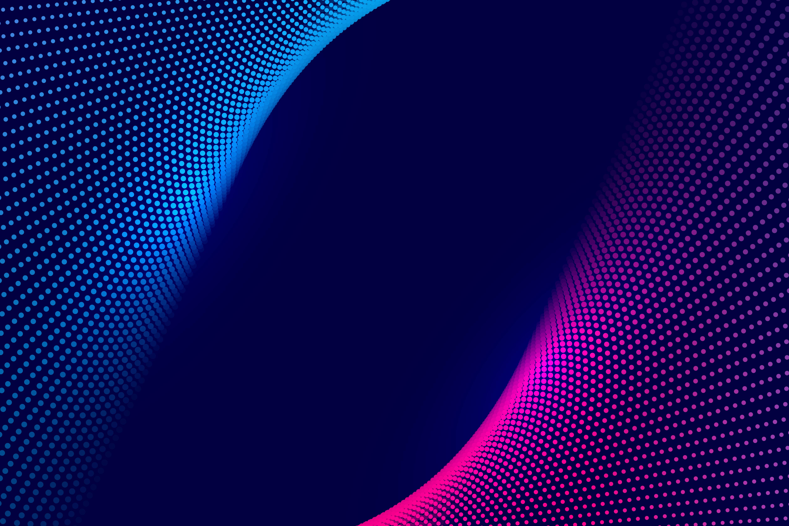
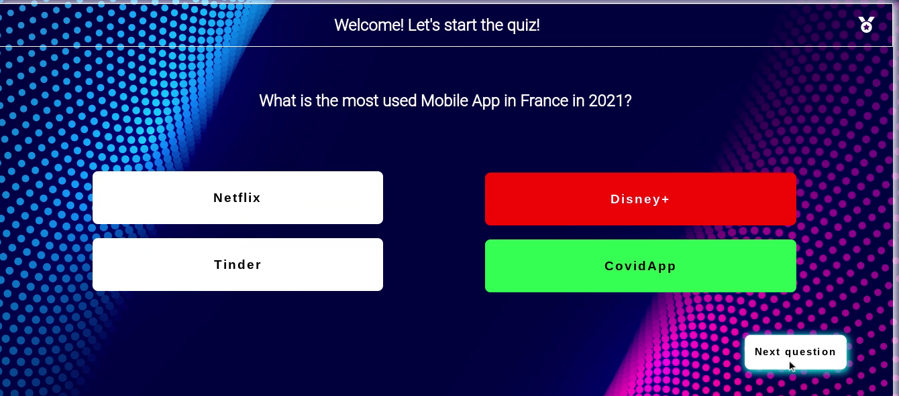

# A Very Funny Trivia Quiz

## Introduction

Trivia quiz game is part of my second portfolio project with Code Institute. 

Trivia quiz is a very funny and simple game to test players knowledge about different countries. It can be played by anyone as the questions are about common knowledge but if you are a traveller as I am you will find it pretty curious.

Here is the [link](https://aimansae.github.io/p2-trivia-quiz/) to the website.

## Table of Contents
- [Trivia Quiz](#a-very-funny-trivia-quiz)
   - [Intrduction](##introduction)
   - [Table of Contents](#table-of-contents)
   - [User Experience](#user-experience)
   - [User Stories](#user-stories)
- [Design](#design) 
   - [Typography](#typpography) 
   - [Images](#images) 
- [Features](#features) 
   - [Home Page](#home-page) 
   - [Start quiz page](#start-quiz-page)
   - [Finish Page](#finish-page)   
- [Technologies Used](#technology-used)   
- [Testing](#testing)
   - [Upcoming Features](#upcoming-features)
   - [Validator Testing](#validator-testing)
- [Responsivness](#responsivness) 
- [Deployment](#deployment)
- [Credits](#credits)  
- [Media](#media)

## User Experience

### User Stories

- With my trivia quiz game my goal is to:

  - create a simple and easy-looking game
  - create a quiz to test general knowledge questions
  - create a quiz that is interactive and visually appealing

- As a first time user:

  - I want to play a challenging quiz
  - I want to play an easy and ituitive game
  - I want to be able to see if my answers are correct or not
  - I want to know the correct answer, if I select the wrong one
  - I want to be alble to play the game again, if it's enjoyable

 ## Design

The idea is to create a good looking quiz that immediately proves it's purpose

 ### Colours Chosen

 The colors chosen are mainly dark and ey ecatching thanks to the background chosen. Here is the palette: 

 

 ### Typography

 I chose 2 main Google Fonts: Abhaya and Roboto, directly imported in my style.css file. "Abhaya" is used for the the answers option, meanwhile "Roboto" for the questions.

[Back to top](#a-very-funny-trivia-quiz)

 ### Images

 For all pages one background is set, with dark and eyecatching colors as mentioned above. The main goal was to give the visitor immediately an idea of what the site is about. 

 

## Features

### Home Page

The Home Page lands to a from where the player has to select a username in order to play the game. The "hover" effect placed on the "start quiz" button makes user's experience even more simple nad pleasant. 
In future this step will be used in order to be able to share score with friends, or download it.
The form is fully validated, empty input or numers or symbols are not accepted.

### Start quiz page

Upon clicking on "Start Quiz button" in directs the user to the quiz.html showing the first question. Once the player selects the answer the option button's background turns into color rgb(125 45 207) to show them which answer they provided, upon clicking on "next question" button js code will turn the answer green if it is correct, red if it's not. In the second case if the selected answer is not correct it will show the right one before proceeding to the next question.

This is the what the players sees once he selects an answer:

### Finish Page

After completing the 10 questions the player will see the last page that congrutalates the user and shows a "Replay" button if the user wants to play the game again

## Technologies Used

- [HTML](https://bit.ly/3uAoc0S)
- [CSS](https://bit.ly/3yTb9KH)
- [JavaScript](https://bit.ly/3c3CH71)

## Testing and bugs
- The testing is made throughout the entire project as I was building it via Google Dev Tool
- The form presents a required attribute so if the user doesn't fill in a name a warning will appear
- All buttons were tested and are working as programmed
- Form validation was initially made throug only HTML code, implemented JS alert function fin case it is submitted empty or with numbers or symbols.
- Console was presenting errors such as "uncaught error cannot set property 'innerhtml'". This was due to the fact that the entire script was wrongly loded in index.html file, looking for codes not used on the file itself.
Fix the error by separating the js code needed for validation in a separate js file, and loaded it in index.html file so just the relevant code is used. 
- Conole presented another error: uncqaught TypeError: cannot read properties of null (reading "textContent" at nextQuestion), due to lack of defensive program. 
Fix the error by implementing the following code: 

let clickedAnswer = document.querySelector('button.answers.active');
if (!clickedAnswer) return;
else {
	clickedAnswer = clickedAnswer.textContent;
}

### Upcoming Features
Due to all the dificulties faces in future I plan to implement additional features for a better user experience. 
- A score function will be added to keep track of the user's score and this will be shown at the end of the game
- A 15 seconds timer per question will be added to keep the excitement and challenge
- An option to share the scores and results will be implemented so that the player can share his results with anyone

### Validator Testing

- HTML : testing is made via [W3C Markup Validator](https://validator.w3.org/nu/?doc=https%3A%2F%2Faimansae.github.io%2Fp2-trivia-quiz%2Ffinish.html)

- CSS : testing is made via [W3C CSS Validator](https://jigsaw.w3.org/css-validator/validator?uri=https%3A%2F%2Faimansae.github.io%2Fp2-trivia-quiz%2Ffinish.html&profile=css3svg&usermedium=all&warning=1&vextwarning=&lang=en)

- JavaScript : Testing is made through [JS Hint](https://jshint.com/) and no error is found.

- Lighthouse: Testing is made for both devices Desktop and Mobile and the resuls is as follows:

### Responsivness

The site is build for big and small devices using media query. It was quite challenging as the "Next question" button for smaller devices could't really fit the container and adapt correctly. This was fixed using left, top and padding in css. Now the game is playable with a decent adaptation on all devices.

## Deployment

The deployment of my site is made wia GithHub pages, theese are the steps I took:

1. Log into GitHub
2. Find repository
3. Click on "Settngs" buttom
3. Select "Pages" on left-hand sidebar
4. Under Source select main as branch
5. Click "Save"
6. On the top of the page the [live](https://aimansae.github.io/p2-trivia-quiz/index.html) link to the website is generated

## Credits

I found JS very challenging, different parts of the code were not working due to small oversights. Help and suggestion were mainly taken from other fellow students on slack and from tutors. In addition I must thank Mike A. who helped me directly with correct and incorrect coloring issue with great advices and tips.
Further tips and suggestions form my mentor Martina who was definitely a lifesavior.

Additional sources were highly consulted such as [Stack Overflow](https://stackoverflow.com/) and numerous Youtube tutorials.

## Media
- Background Image is taken from [Pixaby](https://pixabay.com/)
- Responsive screenshot for Readme File is made via [Am I responsive](https://ui.dev/amiresponsive)
- Colors Palette is generated via [Coolors](https://coolors.co/)

[Back to top](#a-very-funny-trivia-quiz)

